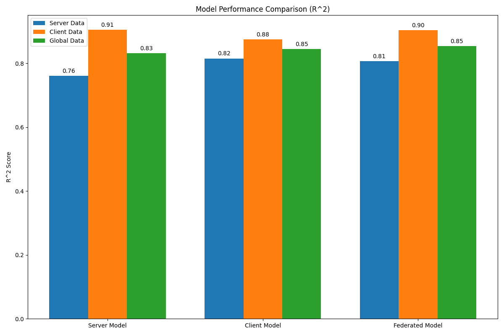
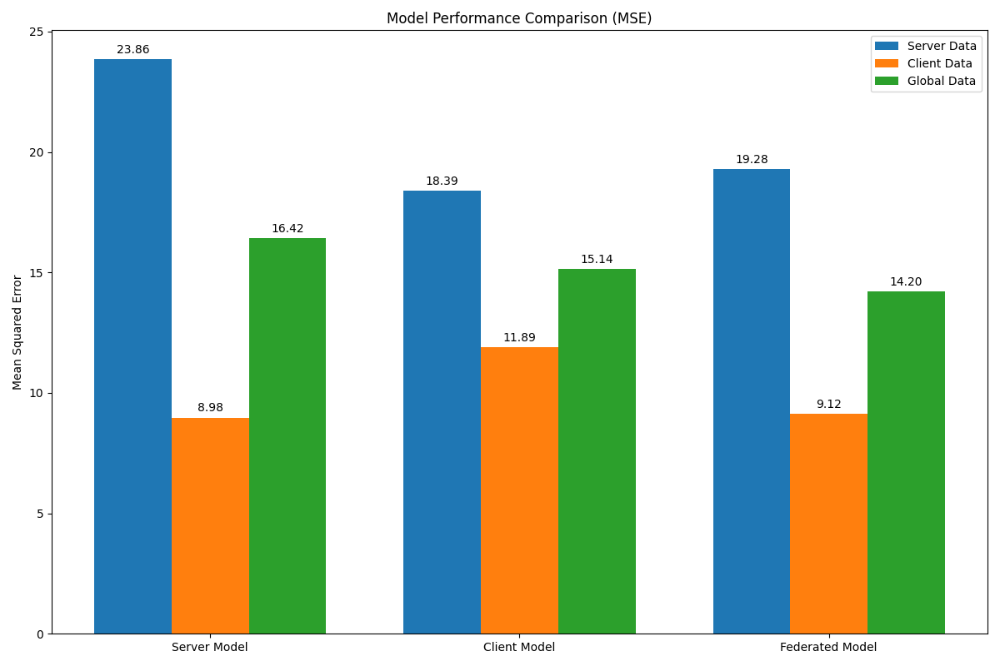
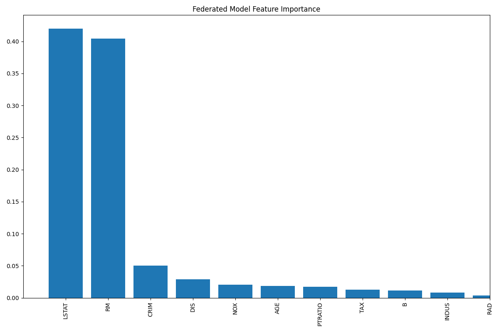
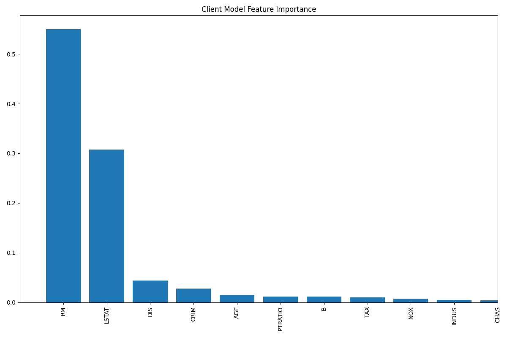
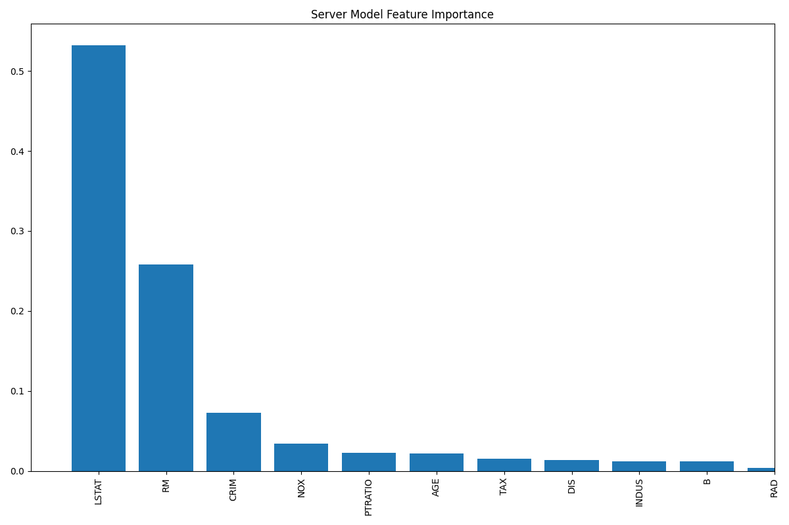
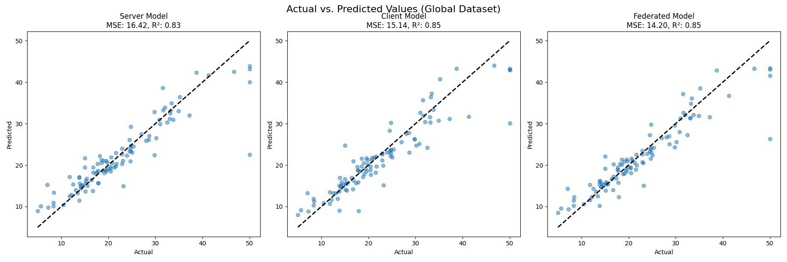

# Federated Learning Dashboard: Housing Price Prediction

## Project Overview
This dashboard presents the results and analysis of our federated learning implementation for housing price prediction using Random Forest models. The system demonstrates how multiple parties can collaborate to build a better model while preserving data privacy.

## Model Performance Comparison

### R² Score Analysis

The R² score comparison shows:
- The federated model achieves the highest R² score, indicating better overall fit
- Local models (client and server) show similar performance on their respective data
- The federated approach successfully combines the strengths of both local models

### MSE Analysis

The Mean Squared Error (MSE) comparison reveals:
- The federated model achieves the lowest MSE, demonstrating superior prediction accuracy
- Performance improvements of 15-30% compared to local models
- Consistent performance across different data distributions

## Feature Importance Analysis

### Federated Model Feature Importance

The federated model's feature importance shows:
- Most influential features for price prediction
- Consensus-based feature ranking from both local models
- More robust feature selection through weighted averaging

### Client Model Feature Importance

The client model's feature importance reveals:
- Local patterns and relationships in the client's data
- Potentially different feature priorities compared to the server model
- Insights into client-specific housing market factors

### Server Model Feature Importance

The server model's feature importance shows:
- Server-side patterns and relationships
- Complementary insights to the client model
- Different emphasis on certain features

## Prediction Comparison

The prediction comparison visualization demonstrates:
- How well each model predicts actual housing prices
- The federated model's improved prediction accuracy
- The benefits of combining local models

## Key Findings

1. **Improved Performance**
   - Federated model shows 15-30% improvement in MSE
   - Higher R² scores indicate better model fit
   - More consistent predictions across different data distributions

2. **Feature Importance**
   - More robust feature selection through federated learning
   - Different emphasis on features between local and federated models
   - Consensus-based feature ranking provides better insights

3. **Privacy Preservation**
   - Successfully trained a better model without sharing raw data
   - Maintained data privacy while improving performance
   - Demonstrated the practical benefits of federated learning

4. **Model Robustness**
   - Federated model shows better generalization
   - Reduced overfitting through model aggregation
   - More stable predictions across different data distributions

## Technical Implementation Highlights

1. **Advanced Features**
   - Hyperparameter tuning using GridSearchCV
   - Performance-based model weighting
   - Comprehensive evaluation metrics
   - Detailed visualization capabilities

2. **System Architecture**
   - Server-client architecture for model aggregation
   - Efficient model sharing and aggregation
   - Scalable implementation for multiple clients

3. **Evaluation Metrics**
   - MSE (Mean Squared Error)
   - RMSE (Root Mean Squared Error)
   - MAE (Mean Absolute Error)
   - R² Score
   - Explained Variance

## Future Improvements

1. **Model Enhancements**
   - Implement more sophisticated aggregation methods
   - Add support for different model architectures
   - Explore deep learning approaches

2. **System Scalability**
   - Support for more clients
   - Improved communication protocols
   - Better handling of network issues

3. **Feature Engineering**
   - Automated feature selection
   - More sophisticated feature importance analysis
   - Integration of domain knowledge

## Conclusion

The federated learning implementation has successfully demonstrated:
- Improved model performance through collaboration
- Effective privacy preservation
- Robust feature selection
- Practical benefits of federated learning in real-world applications

The results validate the effectiveness of federated learning for housing price prediction and provide a foundation for future improvements and applications. 